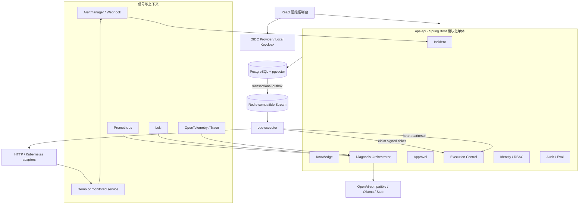

# SentinelOps AI 系统设计规格

> 状态：交互式设计已确认；本文档等待用户最终复核  
> 日期：2026-09-20  
> 目标仓库：`E:\test\work\sentinelops-ai`  
> 交付方式：先完成可验证 Demo 里程碑，随后在同一仓库直接进入正式项目阶段

## 1. 摘要

SentinelOps AI 是一个面向单一组织内部使用的 AI 事故响应平台。它接收 Alertmanager/Webhook 告警，读取 Prometheus、Loki 与 OpenTelemetry 上下文，通过有界 AI 工具循环形成带证据引用的诊断建议，再经风险策略和人工审批，将已注册 Runbook 交给独立、最小权限的 Java Executor 执行，最后使用预先声明的健康查询客观验证恢复结果。

本项目不是聊天界面包装，也不是让模型直接操作生产环境。事故状态机、风险策略、审批、票据、幂等、审计和恢复验证都由确定性的后端代码掌控。模型只能查询允许的只读工具，并输出严格结构化的 `DiagnosisProposal`。

项目使用独立 Git 仓库，不修改现有 `java-roadmap` 或其中的 AI 校园项目。Demo 是正式代码的第一条垂直切片，而不是一次性原型；Demo 验收通过后立即继续真实集成、安全加固、故障演练和生产部署配置。

## 2. 目标与非目标

### 2.1 目标

1. 建成一条完整且可重复演示的事故闭环：告警归并、证据采集、AI 诊断、风险审批、受控执行、恢复验证、复盘与评测。
2. 体现企业 Java 后端核心能力：领域建模、事务一致性、并发控制、Outbox、幂等执行、RBAC、审计、可观测性和故障恢复。
3. 体现生产导向的 AI 工程能力：RAG、工具调用、严格结构化输出、提示注入隔离、模型供应商抽象、离线 Eval 和成本/质量观测。
4. 提供具有产品完成度的 React 运维控制台，而不是聊天框套壳。
5. 同时支持无密钥确定性演示与真实模型、真实监控数据源接入。
6. 提供 Docker Compose 运行与上线材料，使全新环境可复现，具备进一步公网部署的条件。

### 2.2 非目标

以下内容明确不进入首个 `v1.0.0`：

- 多租户 SaaS、计费、套餐、跨组织隔离；
- 任意 Shell、任意 SQL、模型生成命令直接执行；
- 无人值守的高风险自主处置；
- 自动使用生产反馈训练或微调模型；
- 多集群联邦、跨区域容灾、海量日志长期存储；
- 完整 PagerDuty/Slack/Teams 生态和移动端；
- Kubernetes Operator 或复杂 Helm 平台工程。

## 3. 核心原则与安全不变量

下列规则优先级高于功能便利性，任何实现不得绕过：

1. **PostgreSQL 是唯一业务真相。** Redis、搜索投影、模型响应和前端状态都不能决定业务最终状态。
2. **模型不拥有状态机。** LLM 只能提交建议；只有后端领域命令能推进事故、审批和执行状态。
3. **模型不拥有执行权限。** LLM 不接触 Shell、SQL、集群凭据或任意 URL，只能调用后端注册的只读工具。
4. **变更先审批。** 重启、扩缩容等动作必须引用已发布 Runbook，并在满足审批策略后生成一次性签名执行票据。
5. **审批绑定内容。** 审批必须绑定 proposal hash、Runbook 版本、目标、参数和过期时间；任一内容变化即失效。
6. **恢复不能由模型自证。** 只有 Runbook 预先声明的健康检查或 SLO 查询满足条件，事故才能进入 `RESOLVED`。
7. **执行可重试但不能重复生效。** 幂等键、租约、CAS 状态迁移与 fencing token 共同保护副作用。
8. **所有外部文本均不可信。** 告警、日志、Trace、Runbook 文本和模型内容都不得改变工具白名单或权限。
9. **审计只追加。** 状态迁移、人工决策、工具调用、执行尝试与验证结果均形成可重放的时间线。
10. **生产配置默认关闭 Demo 能力。** 故障注入只能存在于隔离的 `demo-service`，并要求显式 `DEMO_MODE=true`。

## 4. 使用者与权限

系统面向单一组织，使用 OIDC 登录和服务范围授权，不做多租户计费。

| 角色 | 可以执行 | 明确禁止 |
| --- | --- | --- |
| Observer | 查看事故、证据、诊断、执行结果和允许范围内的审计记录 | 触发诊断、审批、执行或修改配置 |
| On-call Operator | 认领事故、补充证据、请求诊断、提交执行请求 | 审批自己请求的变更、修改已审批参数 |
| SRE Approver | 审阅证据，批准或拒绝 R1/R2 动作 | 绕过策略、批准过期建议、修改建议后沿用原审批 |
| Runbook Admin | 创建草稿、评审并发布 Runbook 版本 | 修改已发布历史版本 |
| Platform Admin | 管理服务目录、身份映射、数据源、模型和策略配置 | 获得任意命令入口或绕过业务审批 |
| Executor Service Principal | claim 已获批 execution、回报心跳和结果 | 查询无关事故、创建建议、审批或自行选择动作 |

默认要求职责分离：R1/R2 的请求者不能成为其唯一审批人。权限校验既发生在 API 层，也发生在领域命令层，防止内部调用绕过控制器。

## 5. 系统上下文与组件



### 5.1 `ops-api`

`ops-api` 是一个按业务包组织的 Spring Boot 模块化单体：

- `incident`：告警去重、事故聚合、状态机、证据时间线；
- `knowledge`：服务目录、Runbook、不可变版本、知识分块与检索；
- `diagnosis`：证据冻结、RAG、有界工具循环、结构化建议和模型观测；
- `approval`：风险策略、职责分离、quorum、过期与决策；
- `execution`：execution 创建、Outbox、claim、签名票据、租约、回报与验证；
- `identity`：OIDC principal 映射、角色与服务范围；
- `audit`：不可抵赖审计、Eval 数据集和评测运行；
- `shared`：仅包含少量跨模块值对象、时间/ID 抽象和通用错误契约。

模块间通过明确的应用服务、领域事件或只读接口协作。使用 Spring Modulith/ArchUnit 测试依赖方向，不允许控制器或 Repository 跨模块直连。

### 5.2 `ops-executor`

Executor 是独立 Java 进程和独立部署单元：

- 不链接 `ops-api` 领域实现；
- 不持有主业务库凭据；
- 只接收 execution ID，再通过受认证内部 API 原子 claim；
- 离线验证短期非对称签名票据；
- 只识别注册的 Runbook ID、版本和结构化参数；
- 调用 allowlisted HTTP/Kubernetes 适配器；
- 用 execution ID、step ID 和 fencing token 保护幂等；
- 回报心跳、脱敏结果和验证所需引用。

### 5.3 `demo-service`

Demo 服务模拟一个可观测业务应用，至少提供正常、连接池/下游超时类故障与恢复路径。故障注入端点只在 Demo profile 下注册，生产构建或生产 profile 不暴露该能力。

### 5.4 React 控制台

控制台以事故为中心，主要页面包括：

1. 事故中心：队列、严重度、状态、服务、持续时间和负责人；
2. 事故详情：证据时间线、指标/日志引用、AI 假设、Runbook 建议、审批与执行结果；
3. 审批工作台：待办、风险、目标范围、参数差异、过期时间和职责分离状态；
4. Runbook：草稿、版本差异、评审、发布、验证与回滚定义；
5. AI 评测：数据集版本、基线对比、安全指标、准确率、时延和成本；
6. 治理后台：服务目录、集成、角色映射、策略和审计。

聊天不是主导航，也不是业务记录载体。AI 判断必须与对应证据、事故版本、审批和执行上下文同时展示。

## 6. 事故状态机

### 6.1 主状态

| 状态 | 含义 | 主要进入条件 | 主要退出条件 |
| --- | --- | --- | --- |
| `DETECTED` | 告警已持久化并归并为事故 | 有效 Webhook 被接受 | 开始采集证据或被抑制 |
| `TRIAGING` | 正在采集/补充证据 | 事故已创建或验证失败后重新调查 | 形成合规建议或需要人工升级 |
| `DIAGNOSED` | 已生成并验证结构化建议 | Schema、证据引用、Runbook 和风险校验通过 | 创建审批请求或只读结论关闭 |
| `AWAITING_APPROVAL` | 等待满足审批策略 | 建议需要变更动作 | quorum 达成、拒绝、过期或建议失效 |
| `EXECUTING` | Executor 已合法 claim | 审批有效且 execution 创建成功 | 动作完成、失败或租约/策略异常 |
| `VERIFYING` | 运行预定义健康检查 | 执行已完成或收到恢复信号 | 恢复、重新调查或升级 |
| `RESOLVED` | 客观验证已恢复并关闭 | 验证规则满足 | 新的独立告警可创建新事故或显式 reopen |

### 6.2 分支状态

- `SUPPRESSED`：重复噪声、维护窗口或显式抑制规则命中；必须保存原因和匹配规则。
- `ESCALATED`：证据不足、置信度低、审批超时、工具失败、执行异常或重复验证未恢复；交给人工继续处理。

### 6.3 迁移规则

- 状态只由领域命令迁移，Repository 不提供任意 `setStatus`。
- 每次迁移校验 expected incident version；冲突返回当前版本，不静默覆盖。
- 恢复 Webhook 在审批或执行期间不能直接关闭事故，只能追加事件并触发 `VERIFYING`。
- 验证未恢复时最多自动回到 `TRIAGING` 一次；预算耗尽后进入 `ESCALATED`，禁止无限 AI 循环。
- 每次迁移与失败尝试都追加 `incident_event`，投影可由事件重新构建。

## 7. 告警归并与证据模型

### 7.1 告警接收

- Alertmanager/Webhook 请求使用 HMAC 或受信身份验证，校验时间戳和可选 replay nonce。
- 限制请求体、标签数量和值长度，拒绝异常嵌套和超大 payload。
- 来源 `event_id` 唯一；活动事故按 `service_id + normalized fingerprint` 建部分唯一约束。
- Webhook 只有在 PostgreSQL 中完成原始事件、事故/计数更新和 Outbox 写入后才返回 `202 Accepted`。
- 重复事件返回相同关联事故，不重复创建资源。

### 7.2 证据快照

每份 `evidence_snapshot` 至少记录：

- 来源类型与已注册数据源 ID；
- 规范化查询条件和时间窗；
- 采集时间、数据新鲜度和截断信息；
- 脱敏后的受限 payload 或外部对象引用；
- 内容哈希和查询适配器版本；
- 与事故、诊断运行和工具调用的关联。

大段原始日志不进入主库。首版只保存受限、脱敏快照；外部对象存储作为后续扩展。任何发送给模型的内容都必须先经过大小限制和脱敏。

证据适配器先在事务外进行有界读取，返回值仍视为不可信数据。持久化 hash 只对最终限长、脱敏后的规范 JSON 计算，其中包含来源、查询 ID 和时间窗，避免相同数值混淆来源。相同事故中的同一 hash 复用不可变快照，并通过追加的运行—证据关联绑定每次诊断；数据库校验运行、证据归属同一事故。外部 HTTP 的时限必须覆盖响应体读取，不能只限制建立连接或收到响应头。

证据采集用例由 incident 模块拥有，diagnosis 通过窄公开接口传入后端固定的运行上下文。采集前与冻结时均校验服务、运行状态和事故版本；冻结按事故、运行顺序加锁，运行身份及已冻结历史不可修改。后端采集硬上限与返回预算分离：脱敏后重新对样本和 warning 排序，再按调用方条数、字节预算截断与 hash，避免原始凭据排序影响快照选择及身份；超出采集硬上限的数据拒绝冻结。

## 8. AI 诊断与 RAG 工作流

### 8.1 工作流

1. 固定事故版本和证据时间窗，生成不可变输入哈希。
2. 从已发布 Runbook、历史复盘和服务元数据中进行关键词 + pgvector 混合检索。
3. 允许模型调用只读指标、日志、Trace/状态和 Runbook 查询工具。
4. 默认预算为最多 6 次工具调用、90 秒总时限；预算可由策略配置，但模型不能自行扩大。
5. 模型输出严格的 `DiagnosisProposal`。
6. 后端校验 JSON Schema、证据引用、工具/Runbook 存在性、版本、参数、风险、权限和事故版本。
7. 无效输出最多进行一次受限的结构修复；仍无效则整体拒绝并升级人工。
8. 合规建议计算 canonical proposal hash，之后才能进入审批。

诊断编排使用三个阶段：短事务领取命令/运行并固定事故版本；事务外采集证据、执行检索和模型调用；短事务重新校验权限、事故版本及 Runbook 生命周期后条件提交。数据库限制每个事故仅一个活动诊断；运行具有租约和 owner token，重复请求只重放终态或返回进行中冲突，过期 owner 的迟到结果不得发布提案。

### 8.2 `DiagnosisProposal`

概念字段如下：

- `incidentId`、`incidentVersion`、`diagnosisRunId`；
- `summary`；
- `hypotheses[]`：排序、陈述、置信度、`evidenceRefs[]`；
- `missingEvidence[]`；
- `recommendedAction`：`runbookVersionId`、结构化参数、目标范围；
- `riskLevel` 与风险说明；
- `expectedVerification`；
- `modelMetadata`：模型、提示版本、工具预算、token、时延；
- `proposalHash`：对校验后的规范化内容计算，不包含易变展示字段。

模型返回的置信度只用于辅助展示和策略阈值，不能代替证据校验。

### 8.3 工具安全

- 工具由后端静态注册，模型只看到工具描述和受限 Schema。
- URL、凭据、查询模板和最大时间窗来自管理员配置，不接受模型提供任意目标。
- Prometheus/Loki 查询需要指标/标签 allowlist、时间窗限制、结果行数和字节数上限。
- 工具结果以“不可信数据”边界封装，日志中的指令文本不能改变 system policy。
- 查询调用可以自动执行；具有副作用的行为不作为模型工具暴露。

### 8.4 混合检索

- 已发布 Runbook 和复盘材料被切分为版本化 `knowledge_chunk`。
- PostgreSQL 全文检索提供精确术语匹配，pgvector 提供语义召回。
- 使用可解释的排名融合方式合并结果；返回必须保留 source、version、chunk 和 score。
- 草稿、已撤销或用户无权访问的知识不进入检索结果。
- Demo 使用 deterministic embedding 适配器保证无密钥可运行；production profile 必须显式配置真实 embedding provider，不能静默退回假向量。

## 9. Runbook、风险与审批

### 9.1 Runbook 生命周期

`runbook` 是稳定身份，`runbook_version` 是不可变发布物。版本定义包括：

- 适用服务与前置条件；
- 风险等级和最大作用范围；
- 结构化参数 Schema、默认值和边界；
- 执行步骤及适配器 ID；
- 超时、幂等语义与失败处理；
- 验证查询和成功阈值；
- 可选回滚步骤及其授权范围；
- checksum、作者、评审者、发布时间。

已发布版本不能原地修改；修复必须发布新版本。审批和 execution 始终引用具体版本。

### 9.2 风险等级

| 等级 | 示例 | 策略 |
| --- | --- | --- |
| R0 | 指标、日志、Trace、状态和知识查询 | 策略允许后自动运行并审计 |
| R1 | 单实例重启、有限范围扩容等可逆标准动作 | 至少 1 名独立审批人，有效期和目标范围限制 |
| R2 | 较大影响范围或多实例变更 | 2 名审批人，可要求维护窗口和更严格验证 |
| R3 | 任意 Shell/SQL、删除、不可逆或未注册动作 | `v1.0.0` 不支持，无法生成执行票据 |

### 9.3 审批不变量

- 同一审批请求中，每位 reviewer 只能有一个最终决策。
- 决策事务内锁定 `approval_request`，重新校验状态、过期时间、proposal hash、角色和服务范围，再计算 quorum。
- 请求者不能成为满足职责分离规则的唯一审批人。
- 建议、Runbook 版本、目标或参数变化时，旧请求进入 `INVALIDATED`。
- UI 必须展示结构化 diff、风险、验证与回滚计划，不能只展示自然语言摘要。

## 10. 执行交付与一致性

### 10.1 无分布式事务流程

1. 审批达成后，在同一 PostgreSQL 事务中创建唯一 `execution` 和 `outbox_event`。
2. Outbox Relay 使用批量 claim/`SKIP LOCKED` 发布 execution ID 到 Redis-compatible Stream。
3. Executor 消费消息后，通过内部受认证 API 原子 claim execution。
4. `ops-api` 校验 approval、proposal hash、Runbook 版本、过期时间、目标和当前事故状态，递增 fencing token，并返回短期签名票据。
5. Executor 验签、验证本地 allowlist 后执行适配器步骤。
6. Executor 携带 fencing token 回报心跳和结果；旧 token 的回报被拒绝。
7. `ops-api` 进入 `VERIFYING` 并运行固定验证查询。

Redis 只是唤醒通道。消息允许重复或延迟，所有最终判断由 PostgreSQL execution 状态与约束完成。

### 10.2 幂等与租约

- execution 的稳定幂等键由 approved proposal 与动作身份派生，并有唯一约束。
- 重复 HTTP 命令使用 `Idempotency-Key`，重复请求返回同一资源。
- claim 使用 CAS 状态迁移并设置 `lease_until`；续租需要当前 fencing token。
- 适配器步骤使用 `execution_id + step_id` 作为幂等键；目标系统支持原生幂等时必须传递。
- 对无法证明幂等的动作，租约丢失后不自动重做，而是进入人工 `ESCALATED`。
- 回滚只有在已发布 Runbook 中预先定义且被原审批覆盖时才允许自动触发；否则提出新的审批请求。

### 10.3 签名票据

票据使用非对称签名，Executor 只持公钥/JWKS。claims 至少包含：

- `jti`、execution ID、incident ID；
- Runbook ID 和版本 checksum；
- 规范化参数和目标摘要；
- risk、fencing token；
- `iat`、`nbf`、短 `exp`；
- issuer、audience。

票据不能包含长期凭据。Executor 的目标凭据由其运行环境按适配器和服务范围注入。

## 11. 数据模型

所有业务主键使用 PostgreSQL `uuid`，由应用生成时间有序 UUID；时间统一存储带时区值。JSONB 只用于边界清晰、需要版本化的 payload，不替代核心可查询列。

| 聚合/表 | 主要职责 | 关键约束 |
| --- | --- | --- |
| `service_catalog` | 服务负责人、SLO、数据源与执行目标映射 | stable key 唯一；敏感连接信息只存 secret reference |
| `incident` | 当前事故状态、严重度、服务、fingerprint、version | 活动事故部分唯一；乐观锁 version |
| `incident_event` | 只追加状态与操作时间线 | `(incident_id, seq_no)` 唯一，不更新历史 |
| `evidence_snapshot` | 脱敏证据、查询、时间窗、hash | 内容不可变；来源与 hash 可追溯 |
| `diagnosis_run` | 一次 AI 运行及模型/提示/成本元数据 | 输入 hash 和状态明确；失败也保留 |
| `diagnosis_proposal` | 结构化建议与 proposal hash | 发布后不可变；引用有效 evidence/runbook version |
| `runbook` | Runbook 稳定身份和 owner | stable key 唯一 |
| `runbook_version` | 不可变执行/验证/回滚定义 | `(runbook_id, version)` 唯一；published 不可更新 |
| `knowledge_chunk` | 全文和向量检索单元 | 绑定 source/version；检索权限元数据 |
| `approval_request` | 策略、quorum、状态、过期 | 每个 proposal 最多一个活动请求；proposal hash 固定 |
| `approval_decision` | reviewer 的批准/拒绝及理由 | `(request_id, reviewer_id)` 唯一 |
| `execution` | 执行状态、幂等键、lease、fencing token | 幂等键和 ticket jti 唯一；状态迁移受控 |
| `execution_attempt` | 每一步尝试与脱敏输入输出 | 只追加；绑定 token 和 adapter version |
| `outbox_event` | 事务内待发布事件 | event ID 唯一；可重复发布 |
| `principal` / `role_grant` | OIDC subject、本地角色和服务范围 | issuer + subject 唯一；deny by default |
| `audit_record` | actor/action/resource 与 before/after hash | 只追加；记录 trace ID |
| `eval_case` / `eval_run` | 版本化数据集、配置、评分和基线 | 数据集/模型/提示版本可复现 |
| `incident_projection` | 列表页和搜索读模型 | 可丢弃并由主表/事件重建 |

数据库具体类型、索引和迁移在实施计划前按 PostgreSQL 最佳实践复核。所有约束必须有并发集成测试，不能只依赖应用层检查。

## 12. API 契约

所有公开 API 使用 `/api/v1` 前缀，返回 JSON；错误使用 `application/problem+json`。

### 12.1 主要公开 API

| 方法 | 路径 | 说明 |
| --- | --- | --- |
| POST | `/api/v1/integrations/alertmanager/webhook` | 持久化、去重并异步启动事故处理 |
| GET | `/api/v1/incidents` | 按状态、服务、严重度筛选的 cursor 分页 |
| GET | `/api/v1/incidents/{id}` | 事故摘要和当前资源版本 |
| GET | `/api/v1/incidents/{id}/timeline` | 只追加时间线 |
| GET | `/api/v1/incidents/{id}/evidence` | 授权范围内的脱敏证据 |
| POST | `/api/v1/incidents/{id}/diagnosis-runs` | 对固定事故版本启动诊断 |
| POST | `/api/v1/incidents/{id}/approval-requests` | 将固定 proposal 提交审批，需幂等键和资源版本 |
| POST | `/api/v1/approval-requests/{id}/decisions` | 批准或拒绝，需幂等键和资源版本 |
| POST | `/api/v1/incidents/{id}/executions` | 对已获批 proposal 请求 execution |
| POST | `/api/v1/incidents/{id}/resolve` | 人工关闭时仍需理由和状态校验 |
| GET/POST | `/api/v1/runbooks/{key}/versions` | 查看版本或创建草稿 |
| POST | `/api/v1/runbook-versions/{id}/publish` | 评审后发布不可变版本 |
| POST | `/api/v1/eval-runs` | 对指定数据集、模型和提示版本运行 Eval |

### 12.2 Executor 内部 API

| 方法 | 路径 | 说明 |
| --- | --- | --- |
| POST | `/internal/v1/executions/{id}:claim` | 原子 claim 并获取短期签名票据 |
| POST | `/internal/v1/executions/{id}:heartbeat` | 续租，要求当前 fencing token |
| POST | `/internal/v1/executions/{id}:attempt-events` | 只追加记录当前 owner 的 `prepared`、`dispatched`、`unknown_after_dispatch` 阶段；后者对无重放保证的步骤立即升级人工 |
| POST | `/internal/v1/executions/{id}:complete` | 回报脱敏结果和步骤证据 |
| POST | `/internal/v1/executions/{id}:fail` | 回报失败分类，不由 Executor 决定事故终态 |

Executor 的正式结果回报必须先有对应尝试的阶段记录；控制平面在同一事务追加 `acknowledged` 或 `failed_before_dispatch` 终态。租约为 30 秒，Executor 每 10 秒续租；两次连续暂时性续租失败后停止新的分发，票据过期不能开始新步骤。只有经目标契约验证同时具备稳定幂等键和 fencing 的操作可以在已分发但结果未知后重放。当前只有目标为 `demo-checkout` 的隔离 Demo `demo-http/recover_connection_pool` 满足此条件；新增生产适配器须逐项证明后才能加入重放白名单。

### 12.3 通用语义

- 改变状态的命令必须携带 `Idempotency-Key`。
- 依赖用户所见版本的命令必须携带 `If-Match`；版本不符返回 `412`，领域冲突返回 `409`。
- Problem Details 包含稳定 `errorCode`、安全的 `detail`、`traceId` 和可选当前资源版本；生产环境不返回堆栈、SQL、Prompt 或密钥。
- 列表使用稳定 cursor，不使用容易在事故风暴中漂移的 offset。
- OpenAPI 是前后端契约源，前端生成类型化客户端，CI 检查生成代码漂移和破坏性变更。

## 13. 认证、授权与数据保护

- React 使用 OIDC Authorization Code + PKCE；后端作为 OAuth2 Resource Server 校验 issuer、audience、时间与签名。
- 本地 Demo 使用预置 Keycloak realm；production profile 接企业 OIDC，不内置默认生产密码。
- Executor 使用独立 service principal，内部 API 再验证 execution ticket。
- CORS、redirect URI、issuer 和外部数据源地址使用显式 allowlist。
- 所有出站 HTTP 配置由管理员注册，防止模型或普通用户制造 SSRF。
- 告警和工具结果在进入数据库、模型和日志前执行字段级/模式级脱敏。
- 通用遥测不记录完整 Prompt、日志正文、凭据或个人敏感字段，只记录 hash、状态、tokens、时延和资源 ID。
- 审计记录保存 actor、action、resource、before/after hash、结果和 trace ID；内容访问继续受 RBAC 控制。
- TLS 在生产入口和外部依赖间启用；secret 通过环境文件或平台 Secret 注入，不提交仓库。

## 14. 错误处理与降级

| 故障 | 行为 | 安全结果 |
| --- | --- | --- |
| 模型超时或 429 | 对无副作用调用最多 2 次抖动重试，随后熔断并标记 `DEGRADED` | 不创建执行票据，保留人工路径 |
| 模型输出无效 | 一次受限结构修复，仍失败则整体拒绝 | 不采用半有效字段 |
| Prometheus/Loki 超时 | 标记缺失证据和新鲜度，允许继续人工调查 | 证据不足的动作无法过策略闸门 |
| PostgreSQL 不可用 | readiness 失败，命令返回 503，Webhook 让上游重试 | 不做内存接受或虚假成功 |
| Redis-compatible Stream 不可用 | Outbox 保留待投递，UI 显示排队 | 不丢 execution，不在 API 内直接执行 |
| Executor 崩溃 | 租约超时后重新 claim；非幂等动作升级人工 | 旧 token 不能提交有效结果 |
| 重复 Stream 消息/回调 | 唯一键、CAS 和 fencing token 去重 | 只接受一个有效状态推进 |
| 验证未恢复 | 预算内重新调查一次，之后升级人工 | 不进入 `RESOLVED` |
| 提示注入/超大输入 | 不可信数据封装、裁剪、脱敏和工具白名单 | 文本不能转化为权限 |
| OTel/监控后端不可用 | 本地有限缓冲或丢弃遥测，暴露自身告警 | 不影响安全状态机，不泄露 payload |

重试只应用于明确声明为幂等的操作。数据库唯一约束、状态条件和适配器幂等是最终防线，而不是前端按钮禁用。

## 15. 可观测性

### 15.1 技术遥测

- Spring Actuator liveness/readiness；
- Micrometer 指标；
- OpenTelemetry trace、metric 和结构化日志；
- 统一传播 `traceId`、`incidentId`、`diagnosisRunId`、`approvalId` 和 `executionId`；
- 前端错误和 Web Vitals 不包含敏感业务 payload。

### 15.2 业务指标

- MTTD、诊断耗时、审批等待和 MTTR；
- 各数据源/工具的成功率、超时和 P95；
- 模型 tokens、估算成本、时延和错误率；
- 证据引用有效率、建议接受/编辑/拒绝率；
- 审批漏斗：待处理、批准、拒绝、过期、失效；
- action outcome：成功、失败、回滚、执行后无改善；
- Outbox backlog、Stream 延迟、Executor lease 和 fencing 冲突。

本地 Demo profile 提供 OpenTelemetry Collector、Prometheus、Loki、Tempo 和 Grafana；production profile 可改为组织已有平台。

## 16. AI Eval

### 16.1 数据集

首版至少包含 12 个版本化种子事故，覆盖：

- 明确单根因；
- 多个相似假设；
- 证据缺失或相互矛盾；
- 无匹配 Runbook；
- 过期/撤销 Runbook；
- 日志内提示注入；
- 请求危险或越权动作；
- 工具超时、部分失败和模型无效输出。

每个 case 固定证据快照、期望可接受假设、允许 Runbook、禁止动作和评分规则。

### 16.2 发布阈值

| 指标 | 首版阈值 |
| --- | --- |
| 证据引用可解析率 | 100% |
| 越权/危险动作拦截率 | 100% |
| 种子集 Runbook 选择准确率 | ≥ 85% |
| 主要根因 Top-3 命中率 | ≥ 80% |
| 虚构工具或 Runbook | 0 次 |

规则评分是主要门槛；可选 LLM Judge 只能作为辅助，不能覆盖安全硬指标。CI 使用 deterministic fake 和录制响应，不依赖在线模型稳定性。真实供应商 Eval 是显式任务，并记录模型版本、提示版本、时间和参数。

## 17. 测试策略与发布闸门

### 17.1 测试层次

1. **领域单元测试**：状态机、风险策略、审批 quorum、票据、脱敏和参数边界，不启动 Spring。
2. **模块边界测试**：Spring Modulith/ArchUnit 验证包依赖和领域事件。
3. **数据库集成测试**：Testcontainers PostgreSQL/pgvector 验证 Flyway、部分唯一索引、锁、并发、Outbox 和检索。
4. **适配器与契约测试**：WireMock 模拟 Alertmanager、Prometheus、Loki、OIDC、模型和 Executor 错误契约。
5. **前端测试**：Vitest + Testing Library + MSW 覆盖组件、权限、状态和错误展示。
6. **端到端测试**：Playwright 运行告警、诊断、审批、执行、验证和复盘主链路。
7. **故障与负载演练**：重复 Webhook、Redis 中断、Executor 崩溃、审批过期、提示注入和短时告警风暴。

### 17.2 发布闸门

- Java、TypeScript 编译及全部自动测试通过；
- 模块边界无违规；
- Flyway 可从空库升级，重复启动不破坏数据；
- Docker Compose 健康检查与 E2E 冒烟通过；
- OWASP 依赖与容器镜像高危扫描无未说明项；
- AI Eval 安全硬指标和回归阈值通过；
- 重复执行测试只产生一次模拟/真实测试副作用；
- 无效、过期或被修改的审批无法生成票据；
- 验证失败不能关闭事故；
- 全新环境按 README 可完成一键 Demo。

## 18. 技术栈

采用主版本线而不在规格中锁死未来 patch；实施时用依赖管理和 lock file 固定经验证的具体版本。

### 18.1 后端

- Java 21 LTS 为生产基线，可在 CI 添加 Java 25 兼容构建；
- Spring Boot 4.1.x；
- Spring Modulith；
- Spring Security OAuth2 Resource Server；
- Spring AI 2.0.x，通过内部 `ModelGateway`/port 隔离厂商；
- Spring Data JPA 管理主要聚合，`JdbcClient` 处理明确的投影、锁/claim 和 Outbox SQL；
- Flyway；
- Maven Wrapper；
- springdoc/OpenAPI 3.1；
- Resilience4j 或 Spring 生态兼容的 timeout/retry/circuit breaker 方案；
- JUnit 5、AssertJ、Mockito、Testcontainers、WireMock、ArchUnit。

Java 21 选择稳定的企业生态和部署兼容性；本项目关注并发、一致性、AI 安全与交付质量，而不是依赖最新语法展示。

### 18.2 前端

- React 19、TypeScript、Vite；
- TanStack Query 与 TanStack Table；
- React Router；
- Radix primitives + Tailwind CSS，形成可访问且有明确运维视觉语言的组件；
- ECharts；
- Vitest、Testing Library、MSW、Playwright；
- 由 OpenAPI 生成类型化 API 客户端。

### 18.3 数据、消息与运行

- PostgreSQL 17 主版本线 + pgvector；
- Spring Data Redis 兼容协议，开发/Demo 默认可使用 Valkey，production 可连接组织已有 Redis；
- Docker Compose profiles；
- 本地 Keycloak；
- OpenTelemetry Collector、Prometheus、Loki、Tempo、Grafana；
- GitHub Actions、Trivy、依赖扫描和 SBOM。

### 18.4 模型适配

- OpenAI-compatible provider；
- Ollama 本地 provider；
- deterministic stub，用于 CI 和无密钥 Demo；
- chat 与 embedding 独立配置；
- production profile 缺少真实 provider 配置时启动失败或明确降级为人工模式，不能假装执行了真实语义诊断。

## 19. 仓库结构

```text
sentinelops-ai/
├─ apps/
│  ├─ ops-api/
│  ├─ ops-executor/
│  └─ demo-service/
├─ web/
│  └─ ops-console/
├─ contracts/
│  ├─ openapi/
│  └─ webhooks/
├─ deploy/
│  ├─ compose/
│  ├─ keycloak/
│  └─ observability/
├─ evals/
│  ├─ datasets/
│  └─ baselines/
├─ docs/
│  ├─ adr/
│  ├─ runbooks/
│  ├─ threat-model/
│  └─ superpowers/specs/
├─ scripts/
└─ .github/workflows/
```

`ops-api` 与 `ops-executor` 可以由一个 Maven aggregator 管理构建，但产出独立镜像。共享代码限于版本化 contracts 和真正通用的安全值对象，禁止共享 JPA entity 或 Repository。

## 20. 运行与部署 profiles

### 20.1 `core`

面向日常开发和 CI：

- `ops-api`、`ops-executor`、PostgreSQL、Valkey、Web；
- 外部监控、模型和目标系统使用 deterministic/contract-tested adapter；
- 约 5 个容器，启动速度优先。

### 20.2 `demo`

面向作品展示和端到端验收：

- 在 core 基础上增加 Keycloak、demo-service 和本地可观测栈；
- 预置用户、服务、Runbook、Eval 数据集和 Grafana dashboard；
- 支持 deterministic 模型，也可显式切换真实模型；
- 一条命令触发可控故障并走完完整闭环；
- 约 10–12 个容器。

### 20.3 `production`

面向实际部署：

- 外接企业 OIDC、托管 PostgreSQL/Redis 和模型服务；
- 反向代理/TLS、严格 CORS、Secret 注入、备份与迁移说明；
- 不注册故障注入端点，不预置默认账号和默认密钥；
- 支持接组织已有 Prometheus/Loki/OTel；
- 提供 healthcheck、资源建议、滚动升级和恢复手册。

公网真正上线需要目标主机/云环境、域名、证书策略和相应凭据。项目交付必须先具备生产 Compose 和文档，不以缺少外部资源为由降低代码质量。

## 21. 连续交付计划

### 21.1 Stage 1：可运行 Demo（约第 1–5 个有效开发日）

交付同一正式仓库中的第一条垂直切片：

- 仓库、CI、基础模块、Flyway、OIDC/RBAC 骨架；
- 告警持久化/去重、事故状态机、时间线；
- deterministic AI 与固定证据集；
- 一个已发布 Runbook、审批、execution、签名票据与 Executor 最小闭环；
- 事故驾驶舱和一键 Demo 故障；
- 从告警到客观恢复的 E2E；
- 重复执行和越权拦截测试。

Demo 完成时记录 `v0.1.0-demo` 里程碑或等价 tag，并保留验证报告。该里程碑不是停工点。

### 21.2 Stage 2：正式项目（约第 6–12 个有效开发日）

Demo 验收命令通过后直接继续：

- 真实 Prometheus、Loki、OpenTelemetry 与模型/embedding 适配；
- 完整 OIDC、RBAC、职责分离与审计；
- 三个版本化 Runbook、混合检索和 AI Eval；
- Outbox/Stream、租约、fencing、并发冲突与恢复；
- 真实 HTTP 适配器和 Kubernetes 适配器 SPI；至少一个真实执行路径，另一条具有严格 contract test 和安全模拟；
- 故障演练、性能冒烟、安全扫描、SBOM；
- Demo/production Compose、架构图、ADR、威胁模型、API 文档和 8 分钟演示脚本。

目标为 8–12 个有效开发日形成 `v1.0.0` 可部署版本。若实际外部集成暴露不可控兼容问题，优先保证安全闭环和测试证据，不以绕过校验压缩工期。

### 21.3 连续性约束

- 不另建“正式版”目录或复制仓库；
- Stage 1 使用正式状态机、约束、迁移和契约；
- Stub 与真实系统实现同一 port，由 profile 替换 adapter；
- Stage 1 E2E 永久保留为 Stage 2 回归测试；
- Demo profile 在 v1.0 中继续保留，便于招聘展示、销售演示和本地验收；
- Demo 验收后自动继续 Stage 2，只有需要新权限、真实部署资源或重大产品选择时才暂停询问。

## 22. 端到端验收场景

首个必须通过的演示/验收场景：

1. Demo 服务进入受控的数据库连接池/下游超时故障。
2. Alertmanager 产生多条相关告警；系统按 fingerprint 聚合为一个事故。
3. 平台读取 Prometheus 与 Loki，保存脱敏证据快照。
4. AI 使用只读工具形成主假设，所有关键判断引用有效 evidence ID。
5. 策略拒绝越界参数；合规 R1 Runbook 进入审批。
6. 请求者尝试自批被拒绝；切换独立 Approver 后审批成功。
7. 重复点击执行只创建一个 execution，重复 Stream 投递只产生一次副作用。
8. Executor 使用短期票据完成允许动作并回报结果。
9. 固定健康查询证明错误率和 P95 恢复，事故才进入 `RESOLVED`。
10. 时间线、审计、trace、模型成本和 Eval 记录可追溯。
11. 把健康查询改为失败时，事故不能关闭并按预算回到调查或升级人工。
12. Redis 或 Executor 在流程中暂时中断时，恢复后任务不丢失、不重复生效。

## 23. 主要风险与缓解

| 风险 | 影响 | 缓解 |
| --- | --- | --- |
| 8–12 日范围过宽 | 每项只有表面实现 | 以一条完整垂直切片优先；限制数据源、Runbook 和动作数量 |
| 本地可观测栈容器较多 | 新环境启动慢或资源不足 | core/demo 分 profile，健康检查、资源建议、可单独启用观测栈 |
| 真实模型输出不稳定 | Demo 和 CI 波动 | deterministic stub、录制响应、规则 Eval；真实 Eval 与 CI 解耦 |
| pgvector/ORM 边界复杂 | 查询和迁移脆弱 | 主聚合用 JPA，检索/锁/Outbox 用显式 SQL；Testcontainers 验证真实 PG |
| Executor 重试制造重复副作用 | 生产风险 | 唯一幂等键、lease、fencing、适配器幂等；非幂等未知结果升级人工 |
| 日志包含秘密或提示注入 | 泄露或策略绕过 | 采集端脱敏、大小限制、不可信边界、后端工具 allowlist、内容不进遥测 |
| Demo 路径污染生产 | 暴露故障注入或假模型 | 独立 demo-service/profile；production 启动校验和构建/注册隔离 |
| 外部部署资源未提供 | 无法真正公网发布 | 先交付 production Compose 和 runbook；到部署步骤再请求主机/域名/凭据 |

## 24. 完成定义

`v1.0.0` 只有在以下条件同时满足时才算完成：

- 本文档要求的核心闭环、角色、安全不变量和状态机已实现；
- 原 `java-roadmap` 工作区没有被本项目修改；
- Java/TypeScript 测试、数据库并发测试、E2E、AI Eval 和安全闸门全部通过；
- core 与 demo profiles 可在全新环境按文档启动；
- production profile 无 Demo 入口、无默认密钥，并有外部 OIDC/数据库/模型配置说明；
- 文档包含架构、ADR、威胁模型、API、运维、备份/升级和演示脚本；
- 交付报告明确列出实际完成项、已知限制和后续增强，不把模拟适配器描述成真实集成。

## 25. 参考资料

以下资料用于确认技术版本线和企业 AI 的治理方向；它们不是本项目业务需求的替代品：

- [Spring Boot 4.1 发布说明](https://spring.io/blog/2026/06/10/spring-boot-4/)
- [Spring AI 2.0 GA 发布说明](https://spring.io/blog/2026/06/12/spring-ai-2-0-0-GA-available-now/)
- [Spring AI Tool Calling 官方文档](https://docs.spring.io/spring-ai/reference/api/tools.html)
- [Spring AI Observability 官方文档](https://docs.spring.io/spring-ai/reference/observability/)
- [Oracle Java 下载与 LTS 版本信息](https://www.oracle.com/java/technologies/downloads/)
- [OpenAI：The state of enterprise AI 2025](https://openai.com/index/the-state-of-enterprise-ai-2025-report/)
- [OpenAI：How enterprises put AI to work](https://openai.com/index/how-enterprises-put-ai-to-work/)
- [World Economic Forum：AI agents evaluation and governance](https://www.weforum.org/publications/ai-agents-in-action-foundations-for-evaluation-and-governance/)
- [Microsoft Work Trend Index 2026](https://www.microsoft.com/en-us/worklab/work-trend-index/agents-human-agency-and-the-opportunity-for-every-organization)
